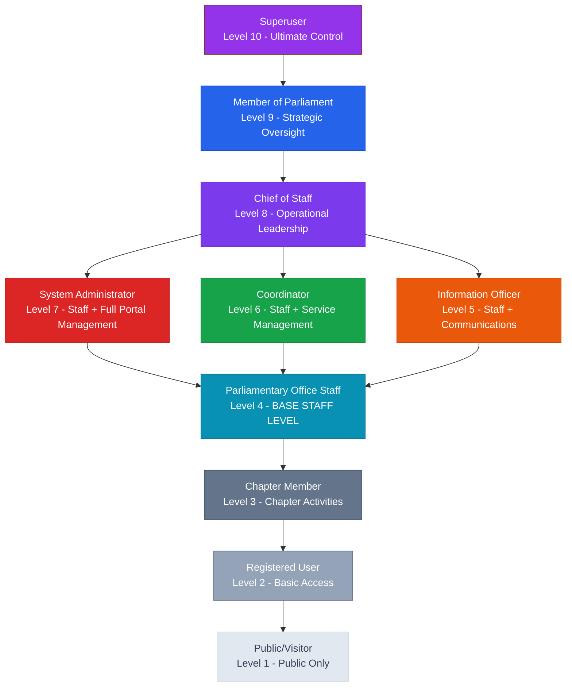
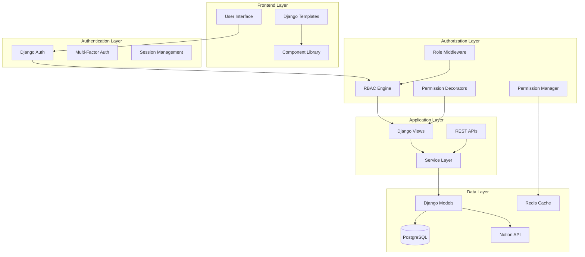
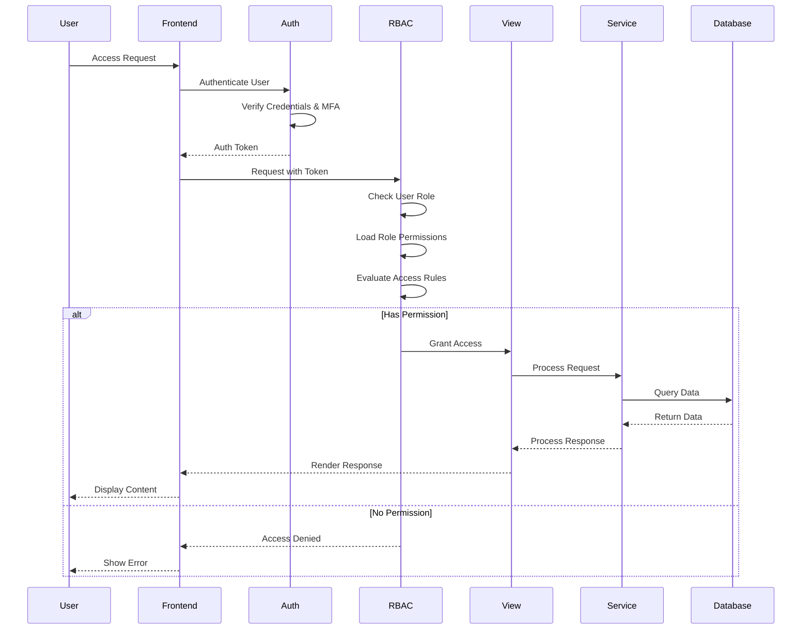
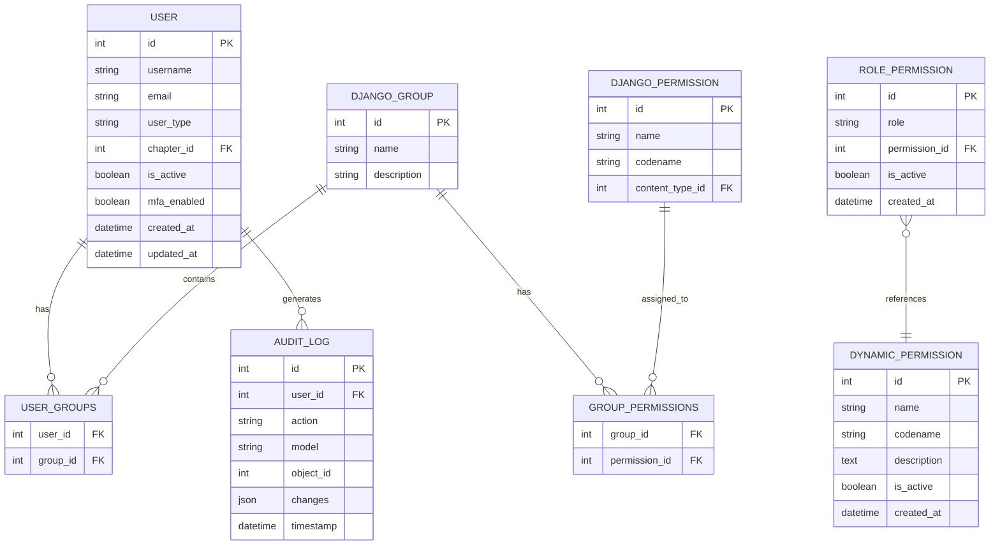
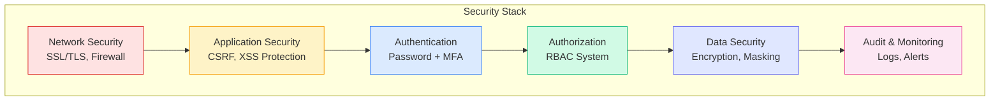
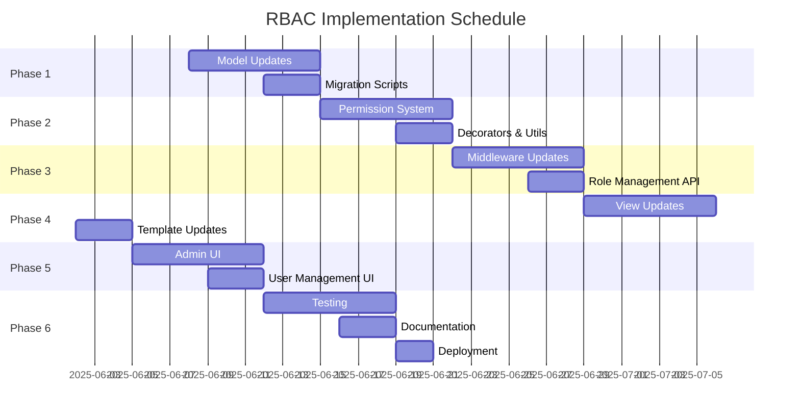
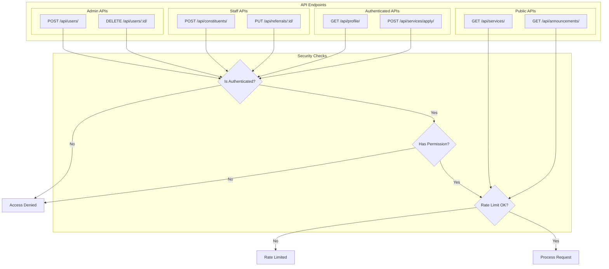
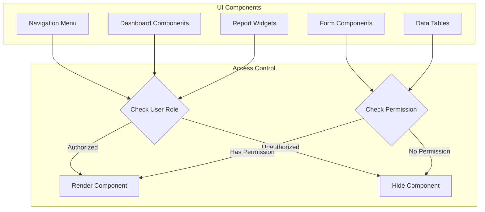

# BM Parliament RBAC Architecture Diagrams

## Role Hierarchy Diagram



## System Architecture



## Permission Flow Diagram



## Module Access Matrix

```mermaid
graph LR
    subgraph "Modules"
        DASH[Dashboard]
        USERS[User Mgmt]
        CONST[Constituents]
        SERV[Services]
        REF[Referrals]
        COMM[Communications]
        ANALYTICS[Analytics]
        ADMIN_MOD[Admin Tools]
        TASKS[Task Mgmt]
        CALENDAR[Calendar]
    end

    subgraph "Roles"
        R_SUPER[Superuser]
        R_MP[MP]
        R_COS[Chief of Staff]
        R_ADMIN[System Admin]
        R_COORD[Coordinator]
        R_INFO[Info Officer]
        R_STAFF[Staff]
        R_MEMBER[Member]
        R_USER[User]
        R_PUBLIC[Public]
    end

    R_SUPER -->|Ultimate Control| DASH
    R_SUPER -->|Ultimate Control| USERS
    R_SUPER -->|Ultimate Control| CONST
    R_SUPER -->|Ultimate Control| SERV
    R_SUPER -->|Ultimate Control| REF
    R_SUPER -->|Ultimate Control| COMM
    R_SUPER -->|Ultimate Control| ANALYTICS
    R_SUPER -->|Ultimate Control| ADMIN_MOD
    R_SUPER -->|Ultimate Control| TASKS
    R_SUPER -->|Ultimate Control| CALENDAR

    R_MP -.->|Strategic View| DASH
    R_MP -.->|Strategic View| ANALYTICS
    R_MP -.->|View Only| TASKS
    R_MP -.->|View Only| CALENDAR
    
    R_COS -->|Full Operational| DASH
    R_COS -->|Role Management| USERS
    R_COS -->|Full Access| CONST
    R_COS -->|Full Access| SERV
    R_COS -->|Full Access| REF
    R_COS -->|Full Access| COMM
    R_COS -->|Full Access| ANALYTICS
    R_COS -->|Workflow Control| ADMIN_MOD
    R_COS -->|Full Access| TASKS
    R_COS -->|Full Access| CALENDAR
    
    R_ADMIN -->|Staff Base Access| TASKS
    R_ADMIN -->|Staff Base Access| CALENDAR
    R_ADMIN -->|Full Technical| USERS
    R_ADMIN -->|Full Technical| ADMIN_MOD
    R_ADMIN -->|Full Access| CONST
    R_ADMIN -->|Full Access| SERV
    R_ADMIN -->|Full Access| REF
    R_ADMIN -->|Full Access| COMM
    R_ADMIN -->|Reports Access| ANALYTICS
    
    R_COORD -->|Staff Base Access| TASKS
    R_COORD -->|Staff Base Access| CALENDAR
    R_COORD -->|Service Management| CONST
    R_COORD -->|Service Management| SERV
    R_COORD -->|Service Management| REF
    R_COORD -->|Service Reports| ANALYTICS
    
    R_INFO -->|Staff Base Access| TASKS
    R_INFO -->|Staff Base Access| CALENDAR
    R_INFO -->|Full Communications| COMM
    R_INFO -->|Content Analytics| ANALYTICS
    
    R_STAFF -->|Base Access| TASKS
    R_STAFF -->|Base Access| CALENDAR
    
    R_MEMBER -->|Own Data| CONST
    R_MEMBER -->|Apply| SERV
    R_MEMBER -->|View Own| REF
    
    R_USER -->|Own Profile| CONST
    R_USER -->|View & Apply| SERV
    
    R_PUBLIC -->|View Only| COMM
    R_PUBLIC -->|View Info| SERV
```



## Database Schema for RBAC



## Security Layers



## Implementation Timeline



## API Endpoint Security Matrix



## Role Transition Workflow

```mermaid
stateDiagram-v2
    [*] --> Public: Visit Site
    Public --> RegisteredUser: Sign Up
    RegisteredUser --> ChapterMember: Verify & Join Chapter
    
    %% Staff-based promotion paths
    RegisteredUser --> Staff: Hired as Parliamentary Staff
    ChapterMember --> Staff: Promoted to Parliamentary Staff
    
    %% Staff role progressions (all inherit from Staff base)
    Staff --> InfoOfficer: Assigned Communication Role
    Staff --> Coordinator: Assigned Service Coordination Role  
    Staff --> Admin: Assigned System Administration Role
    
    %% Higher level assignments
    InfoOfficer --> Coordinator: Cross-training/Promotion
    Coordinator --> Admin: Technical Promotion
    Admin --> ChiefOfStaff: Leadership Assignment
    ChiefOfStaff --> MP: Not Applicable (Elected Position)
    
    %% Superuser assignments
    Admin --> Superuser: Ultimate Access Assignment
    ChiefOfStaff --> Superuser: Ultimate Access Assignment
    
    state "Staff-Based Hierarchy" {
        InfoOfficer: Staff + Communications
        Coordinator: Staff + Services  
        Admin: Staff + Full Management
    }
    
    %% Deactivation paths
    RegisteredUser --> [*]: Account Deactivated
    ChapterMember --> [*]: Account Deactivated
    Staff --> [*]: Employment Ended
    InfoOfficer --> [*]: Employment Ended
    Coordinator --> [*]: Employment Ended
    Admin --> [*]: Employment Ended
```

## Component Access Control



These diagrams provide a comprehensive visual representation of the RBAC architecture, including:

1. **Role Hierarchy**: Shows the hierarchical relationship between roles with staff-based inheritance
2. **System Architecture**: Illustrates the technical layers and components
3. **Permission Flow**: Demonstrates how permissions are evaluated
4. **Module Access Matrix**: Maps roles to module access with staff base level
5. **Database Schema**: Shows the RBAC data model
6. **Security Layers**: Illustrates the defense-in-depth approach
7. **Implementation Timeline**: Gantt chart for project phases
8. **API Security**: Shows API endpoint protection
9. **Role Transitions**: State diagram for role changes with staff-based progression
10. **Component Access**: UI component visibility control

## Key Architecture Updates

The diagrams have been updated to reflect the corrected staff-based hierarchy:

- **Parliamentary Office Staff (Level 4)**: Established as the BASE LEVEL for all parliamentary workers
- **Information Officer (Level 5)**: Staff + Communication management capabilities
- **Coordinator (Level 6)**: Staff + Service coordination and management capabilities  
- **System Administrator (Level 7)**: Staff + Full portal management and technical control
- **Staff-Based Inheritance**: All parliamentary roles (Info Officer, Coordinator, Admin) inherit base staff permissions for task/calendar management
- **Clear Role Progression**: Shows natural promotion paths through the staff-based hierarchy
- **Enhanced Module Access**: Task Management and Calendar modules added to reflect staff base functionality

This architecture ensures that all parliamentary workers have consistent access to core office functionality while maintaining role-specific capabilities and security boundaries.

These diagrams can be rendered using any Mermaid-compatible viewer or documentation system.