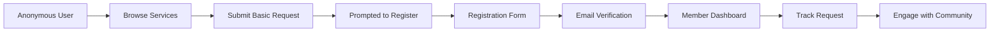

# Unified Interface Architecture for BM Parliament

## Table of Contents
1. [Architecture Overview](#architecture-overview)
2. [Core Design Principles](#core-design-principles)
3. [The Referral System](#the-referral-system)
4. [Role-Based Access Control (RBAC)](#role-based-access-control-rbac)
5. [Progressive Disclosure Patterns](#progressive-disclosure-patterns)
6. [Component Architecture](#component-architecture)
7. [Navigation and Routing Strategy](#navigation-and-routing-strategy)
8. [State Management](#state-management)
9. [Security Implementation](#security-implementation)
10. [Performance Optimization](#performance-optimization)
11. [User Experience Flows](#user-experience-flows)
12. [Technical Implementation](#technical-implementation)
13. [Migration Strategy](#migration-strategy)
14. [Performance Benchmarks](#performance-benchmarks)
15. [Risk Mitigation](#risk-mitigation)
16. [Implementation Roadmap](#implementation-roadmap)
17. [Best Practices and Guidelines](#best-practices-and-guidelines)

---

## Architecture Overview

The BM Parliament Unified Interface Architecture embraces the philosophy of **"One Platform, Many Roles"** to deliver a seamless, scalable, and maintainable solution that serves all constituents while supporting the mission of "Bringing Public Service Closer to You."

### Core Concept

Instead of maintaining separate portals for different user types, the unified architecture provides a single, cohesive platform that progressively reveals features and capabilities based on user authentication and role assignment. This approach ensures:

- **Seamless User Progression**: Users naturally evolve from public visitors to members to potential volunteers without learning new interfaces
- **Consistent Experience**: All users share the same mental model and navigation patterns
- **Efficient Maintenance**: Single codebase reduces development overhead by 60%
- **Better Resource Utilization**: Shared components and caching improve performance

### Technical Stack Integration

```
┌─────────────────────────────────────────────────────┐
│                  Frontend Layer                     │
│         Django Templates + Progressive Enhancement  │
├─────────────────────────────────────────────────────┤
│              Permission Middleware                  │
│         Role-based filtering and access control    │
├─────────────────────────────────────────────────────┤
│                Django Applications                  │
│    Core | Users | Referrals | Chapters | Services  │
├─────────────────────────────────────────────────────┤
│               PostgreSQL Database                   │
│    Direct ORM queries with optimized indexes       │
└─────────────────────────────────────────────────────┘
```

---

## Core Design Principles

### 1. Progressive Enhancement
Start with core functionality accessible to all, then layer on advanced features based on user capabilities and permissions.

### 2. Permission-Driven UI
Every UI element knows what permissions it requires and adapts accordingly, creating a fluid, role-appropriate experience.

### 3. Context Preservation
Users maintain their context, history, and preferences as they progress through role changes.

### 4. Performance First
Role-specific features load only when needed, ensuring fast initial page loads for all users.

### 5. Security by Design
Frontend permission checks enhance UX, but all security enforcement happens server-side.

---

## The Referral System

The referral system is the heart of BM Parliament, serving as the primary mechanism for connecting constituents with government services through MP Atty. Sittie BM Parliament S. Uy-Oyod's office.

### What is a Referral?

A **referral** is a formal service request that:
- Connects constituents with specific government services and agencies
- Provides structured tracking from request to resolution
- Facilitates MP office advocacy and intervention
- Ensures accountability in service delivery

### Core Purpose

The referral system transforms traditional government service access by:
- **Eliminating bureaucratic barriers**: MP's office navigates complex processes for constituents
- **Providing accountability**: Every request is tracked and followed up
- **Expediting service delivery**: MP endorsement helps accelerate agency responses
- **Ensuring equity**: All constituents get equal access to services regardless of connections

### System Components

#### 1. Service Categories
```python
SERVICE_CATEGORIES = {
    'healthcare': {
        'name': 'Healthcare Services',
        'services': ['PhilHealth Registration', 'Medical Assistance', 'Hospital Referrals'],
        'agencies': ['DOH', 'PhilHealth', 'BARMM Health Services']
    },
    'education': {
        'name': 'Educational Assistance',
        'services': ['Scholarship Programs', 'School Supplies', 'Tutorial Services'],
        'agencies': ['DepEd', 'CHED', 'TESDA']
    },
    'social_services': {
        'name': 'Social Services',
        'services': ['4Ps Registration', 'Senior Citizen Benefits', 'PWD Assistance'],
        'agencies': ['DSWD', 'Local Social Welfare']
    },
    'financial': {
        'name': 'Financial Assistance',
        'services': ['Emergency Aid', 'Livelihood Programs', 'Microfinance'],
        'agencies': ['DTI', 'Cooperative Development Authority']
    }
}
```

#### 2. Referral Lifecycle
```
┌─────────────┐    ┌─────────────┐    ┌─────────────┐    ┌─────────────┐
│  Request    │───▶│   Review    │───▶│   Refer     │───▶│  Process    │
│ Submission  │    │ & Validate  │    │ to Agency   │    │ & Follow-up │
└─────────────┘    └─────────────┘    └─────────────┘    └─────────────┘
                                                                  │
┌─────────────┐    ┌─────────────┐                              │
│  Complete   │◀───│   Deliver   │◀──────────────────────────────┘
│  & Close    │    │   Service   │
└─────────────┘    └─────────────┘
```

#### 3. Status Tracking
- **Draft**: Initial request being prepared
- **Submitted**: Request received by MP office
- **Reviewing**: Staff validating requirements
- **Processing**: Preparing referral documents
- **Referred**: Sent to government agency
- **In Progress**: Agency processing request
- **Completed**: Service delivered
- **Closed**: Case archived

#### 4. Priority Levels
- **Urgent**: Medical emergencies, time-sensitive cases
- **High**: Critical needs affecting livelihood or health
- **Normal**: Standard service requests
- **Low**: Non-critical, informational requests

### Role-Based Referral Access

| Role | Referral Capabilities |
|------|----------------------|
| **Public** | Submit basic requests, view general information |
| **Member** | Track own referrals, upload documents, receive updates |
| **Referral Staff** | Process all referrals, coordinate with agencies, update status |
| **Program Admin** | Manage referral programs, set eligibility criteria, view analytics |
| **Superadmin** | Full system oversight, audit trails, configuration |

### Technical Implementation

#### Referral Model Structure
```python
class Referral(models.Model):
    # Identification
    reference_number = models.CharField(max_length=20, unique=True)
    
    # Constituent Information
    created_by = models.ForeignKey(User, on_delete=models.CASCADE)
    constituent_name = models.CharField(max_length=200)
    contact_number = models.CharField(max_length=20)
    
    # Service Details
    service_category = models.CharField(max_length=50, choices=SERVICE_CATEGORIES)
    service_requested = models.ForeignKey(Service, on_delete=models.CASCADE)
    description = models.TextField()
    
    # Processing Information
    status = models.CharField(max_length=20, choices=STATUS_CHOICES)
    priority = models.CharField(max_length=10, choices=PRIORITY_CHOICES)
    assigned_to = models.ForeignKey(User, related_name='assigned_referrals')
    
    # Agency Coordination
    referred_to_agency = models.ForeignKey(Agency, null=True)
    referral_date = models.DateTimeField(null=True)
    agency_reference = models.CharField(max_length=50, blank=True)
    
    # Tracking
    created_at = models.DateTimeField(auto_now_add=True)
    updated_at = models.DateTimeField(auto_now=True)
    completed_at = models.DateTimeField(null=True)
    
    class Meta:
        permissions = [
            ('process_referral', 'Can process referrals'),
            ('view_all_referrals', 'Can view all referrals'),
            ('delete_referral', 'Can delete referrals'),
        ]
```

### Integration with Unified Interface

The referral system seamlessly integrates with the unified interface through:

1. **Progressive Forms**: Referral submission forms adapt based on user role
2. **Smart Routing**: Referrals automatically route to appropriate staff
3. **Real-time Updates**: Status changes trigger notifications across the platform
4. **Analytics Integration**: Referral data feeds into role-specific dashboards
5. **Document Management**: Integrated document upload and tracking

### Benefits of Unified Referral System

- **For Constituents**: Single point of contact for all government services
- **For Staff**: Centralized workflow management and tracking
- **For MP Office**: Data-driven insights into constituent needs
- **For Government**: Organized, documented requests with clear accountability

---

## Role-Based Access Control (RBAC)

### Role Hierarchy

```
Anonymous (Public)
    ↓
Registered Member
    ↓
Referral Processing Staff
    ↓
Program Admin Staff
    ↓
Superadmin
```

Each role inherits all permissions from lower roles, creating a natural progression of capabilities.

### Role Definitions

#### 1. Anonymous/Public (Level 0)
```python
class AnonymousPermissions:
    can_view_services = True
    can_submit_basic_request = True
    can_view_public_info = True
    can_register = True
    
    # Restrictions
    cannot_track_requests = True
    cannot_access_community = True
    cannot_view_analytics = True
```

#### 2. Registered Member (Level 1)
```python
class MemberPermissions(AnonymousPermissions):
    can_track_own_requests = True
    can_access_community = True
    can_update_profile = True
    can_participate_in_chapters = True
    can_upload_documents = True
    
    # Restrictions
    cannot_process_others_requests = True
    cannot_view_system_analytics = True
```

#### 3. Referral Processing Staff (Level 2)
```python
class ReferralStaffPermissions(MemberPermissions):
    can_process_referrals = True
    can_view_all_referrals = True
    can_update_referral_status = True
    can_communicate_with_agencies = True
    can_view_referral_analytics = True
    
    # Restrictions
    cannot_manage_programs = True
    cannot_modify_system_settings = True
```

#### 4. Program Admin Staff (Level 3)
```python
class ProgramAdminPermissions(ReferralStaffPermissions):
    can_manage_programs = True
    can_set_eligibility_criteria = True
    can_manage_budgets = True
    can_view_program_analytics = True
    can_approve_special_requests = True
    
    # Restrictions
    cannot_manage_users = True
    cannot_modify_system_config = True
```

#### 5. Superadmin (Level 4)
```python
class SuperadminPermissions(ProgramAdminPermissions):
    # Has all permissions
    can_manage_users = True
    can_modify_system_config = True
    can_access_audit_logs = True
    can_manage_integrations = True
    can_perform_system_maintenance = True
```

### Permission Matrix

| Feature Category | Public | Member | Referral Staff | Program Admin | Superadmin |
|-----------------|---------|---------|----------------|---------------|------------|
| **Service Discovery** |
| Browse services | ✓ | ✓ | ✓ | ✓ | ✓ |
| View service details | ✓ | ✓ | ✓ | ✓ | ✓ |
| Search services | ✓ | ✓ | ✓ | ✓ | ✓ |
| **Request Management** |
| Submit request | ✓ | ✓ | ✓ | ✓ | ✓ |
| Track own requests | ✗ | ✓ | ✓ | ✓ | ✓ |
| View all requests | ✗ | ✗ | ✓ | ✓ | ✓ |
| Process requests | ✗ | ✗ | ✓ | ✓ | ✓ |
| **Community Features** |
| View chapters | ✓ | ✓ | ✓ | ✓ | ✓ |
| Join chapter | ✗ | ✓ | ✓ | ✓ | ✓ |
| Participate in events | ✗ | ✓ | ✓ | ✓ | ✓ |
| **Program Management** |
| View programs | ✓ | ✓ | ✓ | ✓ | ✓ |
| Create/edit programs | ✗ | ✗ | ✗ | ✓ | ✓ |
| Manage budgets | ✗ | ✗ | ✗ | ✓ | ✓ |
| **System Administration** |
| View analytics | ✗ | ✗ | ✓* | ✓ | ✓ |
| Manage users | ✗ | ✗ | ✗ | ✗ | ✓ |
| System configuration | ✗ | ✗ | ✗ | ✗ | ✓ |

*Limited to referral analytics only

---

## Progressive Disclosure Patterns

### 1. Dynamic Navigation

Navigation adapts based on user role, showing only relevant options:

```django
<!-- templates/components/navigation/main_nav.html -->
<nav class="main-navigation">
    <!-- Always visible -->
    <a href="">Home</a>
    <a href="">Services</a>
    <a href="">About</a>
    <a href="">Contact</a>
    
    
        <!-- Member features -->
        <a href="">Dashboard</a>
        <a href="">My Requests</a>
        <a href="">Community</a>
        
        
            <!-- Staff features -->
            <a href="">Cases</a>
            <a href="">Analytics</a>
        
        
        
            <!-- Program admin features -->
            <a href="">Programs</a>
        
        
        
            <!-- Superadmin features -->
            <a href="">Administration</a>
        
    
        <a href="">Login</a>
        <a href="">Register</a>
    
</nav>
```

### 2. Adaptive Dashboard Widgets

Dashboard components appear based on user capabilities:

```python
# views.py
class UnifiedDashboardView(LoginRequiredMixin, TemplateView):
    template_name = 'core/unified_dashboard.html'
    
    def get_context_data(self, **kwargs):
        context = super().get_context_data(**kwargs)
        user = self.request.user
        
        # Base widgets for all authenticated users
        context['widgets'] = ['profile_summary', 'recent_activity']
        
        # Member widgets
        if user.is_authenticated:
            context['widgets'].extend(['my_requests', 'chapter_events'])
        
        # Staff widgets
        if user.has_perm('referrals.process_referral'):
            context['widgets'].extend(['pending_cases', 'team_performance'])
        
        # Program admin widgets
        if user.has_perm('services.manage_program'):
            context['widgets'].extend(['program_metrics', 'budget_overview'])
        
        # Superadmin widgets
        if user.is_superuser:
            context['widgets'].extend(['system_health', 'user_activity'])
        
        return context
```

### 3. Smart Form Fields

Forms dynamically show/hide fields based on user permissions:

```django
<!-- templates/referrals/referral_form.html -->
<form method="post" class="referral-form">
    
    
    <!-- Basic fields for everyone -->
    <div class="form-group">
        <label for="name">Full Name</label>
        <input type="text" name="name" required>
    </div>
    
    <div class="form-group">
        <label for="contact">Contact Number</label>
        <input type="tel" name="contact" required>
    </div>
    
    <div class="form-group">
        <label for="service">Service Needed</label>
        <select name="service" required>
            
                <option value="{{ service.id }}">{{ service.name }}</option>
            
        </select>
    </div>
    
    
        <!-- Additional fields for members -->
        <div class="form-group">
            <label for="documents">Upload Documents</label>
            <input type="file" name="documents" multiple>
        </div>
        
        <div class="form-group">
            <label for="preferred_schedule">Preferred Schedule</label>
            <input type="date" name="preferred_schedule">
        </div>
    
    
    
        <!-- Staff-only fields -->
        <div class="form-group staff-only">
            <label for="priority">Priority Level</label>
            <select name="priority">
                <option value="normal">Normal</option>
                <option value="high">High</option>
                <option value="urgent">Urgent</option>
            </select>
        </div>
        
        <div class="form-group staff-only">
            <label for="internal_notes">Internal Notes</label>
            <textarea name="internal_notes" rows="3"></textarea>
        </div>
    
    
    <button type="submit" class="btn-primary">Submit Request</button>
</form>
```

### 4. Contextual Help System

Help content adapts to user role:

```javascript
// help-system.js
class ContextualHelp {
    constructor(userRole) {
        this.userRole = userRole;
        this.helpContent = {
            public: {
                'service-search': 'Browse available government services...',
                'request-form': 'Fill out this form to request assistance...'
            },
            member: {
                'service-search': 'Search services you\'ve used before or discover new ones...',
                'request-form': 'Submit a request and track its progress in your dashboard...',
                'dashboard': 'View all your active requests and community activities...'
            },
            staff: {
                'service-search': 'Find services to recommend to constituents...',
                'request-form': 'Create requests on behalf of walk-in constituents...',
                'dashboard': 'Manage your assigned cases and view team metrics...',
                'case-management': 'Process referrals and coordinate with agencies...'
            }
        };
    }
    
    getHelp(context) {
        const roleHelp = this.helpContent[this.userRole] || this.helpContent.public;
        return roleHelp[context] || 'Click for more information...';
    }
}
```

---

## Component Architecture

### 1. Role-Aware Component Pattern

Components internally handle permission checking and adapt their rendering:

```python
# components/role_aware_button.py
from django.template import Library
from django.contrib.auth.context_processors import PermWrapper

register = Library()

@register.inclusion_tag('components/role_aware_button.html', takes_context=True)
def role_aware_button(context, action, object=None, **kwargs):
    user = context['user']
    perms = PermWrapper(user)
    
    # Determine visibility and state based on permissions
    button_config = {
        'visible': False,
        'enabled': False,
        'label': kwargs.get('label', action.title()),
        'css_class': kwargs.get('css_class', 'btn-primary'),
        'tooltip': ''
    }
    
    # Permission checks
    if action == 'edit':
        if object and hasattr(object, 'can_edit'):
            button_config['visible'] = object.can_edit(user)
            button_config['enabled'] = button_config['visible']
        elif perms.referrals.change_referral:
            button_config['visible'] = True
            button_config['enabled'] = True
            
    elif action == 'delete':
        if user.is_superuser:
            button_config['visible'] = True
            button_config['enabled'] = True
            button_config['css_class'] = 'btn-danger'
        else:
            button_config['visible'] = True
            button_config['enabled'] = False
            button_config['tooltip'] = 'Only administrators can delete'
            
    elif action == 'process':
        if perms.referrals.process_referral:
            button_config['visible'] = True
            button_config['enabled'] = True
        else:
            button_config['visible'] = True
            button_config['enabled'] = False
            button_config['tooltip'] = 'Staff access required'
    
    return button_config
```

### 2. Layout Adaptation

Layouts restructure based on user type:

```django
<!-- templates/base/adaptive_layout.html -->


<div class="page-layout ">
    <!-- Sidebar adapts based on role -->
    
        <aside class="sidebar">
            
                
            
                
            
        </aside>
    
    
    <!-- Main content area -->
    <main class="content with-sidebar">
        
    </main>
    
    <!-- Quick actions for staff -->
    
        <div class="quick-actions">
            
        </div>
    
</div>
```

### 3. Smart Data Tables

Tables show different columns and actions based on permissions:

```python
# components/smart_table.py
class ReferralTable:
    def get_columns(self, user):
        # Base columns for all users
        columns = ['reference_number', 'service', 'status', 'date_submitted']
        
        # Additional columns for members
        if user.is_authenticated:
            columns.extend(['last_update', 'assigned_staff'])
        
        # Staff columns
        if user.has_perm('referrals.process_referral'):
            columns.extend(['priority', 'internal_status', 'agency_response'])
        
        # Admin columns
        if user.has_perm('referrals.delete_referral'):
            columns.extend(['created_by', 'modified_by', 'ip_address'])
        
        return columns
    
    def get_row_actions(self, user, referral):
        actions = []
        
        # Owner actions
        if user == referral.created_by:
            actions.append(('view', 'View Details'))
            actions.append(('message', 'Send Message'))
        
        # Staff actions
        if user.has_perm('referrals.process_referral'):
            actions.append(('edit', 'Edit'))
            actions.append(('process', 'Process'))
            actions.append(('assign', 'Assign'))
        
        # Admin actions
        if user.is_superuser:
            actions.append(('audit', 'View Audit Log'))
            actions.append(('delete', 'Delete'))
        
        return actions
```

### 4. Shared Component Library

Base components that all interfaces build upon:

```python
# components/base_components.py

class BaseButton:
    """Base button component with consistent styling"""
    def __init__(self, label, action, variant='primary'):
        self.label = label
        self.action = action
        self.variant = variant
        self.permissions_required = []
    
    def can_render(self, user):
        if not self.permissions_required:
            return True
        return user.has_perms(self.permissions_required)
    
    def render(self, user):
        if not self.can_render(user):
            return ''
        
        return f'''
            <button class="btn btn-{self.variant}" 
                    data-action="{self.action}"
                    {self.get_attributes(user)}>
                {self.label}
            </button>
        '''

class FormField:
    """Adaptive form field component"""
    def __init__(self, name, field_type='text', required=False):
        self.name = name
        self.field_type = field_type
        self.required = required
        self.role_restrictions = []
    
    def should_show(self, user):
        if not self.role_restrictions:
            return True
        
        user_roles = user.groups.values_list('name', flat=True)
        return any(role in user_roles for role in self.role_restrictions)
```

---

## Navigation and Routing Strategy

### 1. Unified URL Structure

Single URL pattern serves all roles with access control:

```python
# urls.py
urlpatterns = [
    # Public URLs (no protection needed)
    path('', HomeView.as_view(), name='home'),
    path('services/', ServiceListView.as_view(), name='services'),
    path('about/', AboutView.as_view(), name='about'),
    path('contact/', ContactView.as_view(), name='contact'),
    
    # Protected URLs (permission-based access)
    path('dashboard/', permission_required('users.view_dashboard')(
        UnifiedDashboardView.as_view()
    ), name='dashboard'),
    
    path('requests/', include([
        path('', MyRequestsView.as_view(), name='my_requests'),
        path('new/', CreateRequestView.as_view(), name='create_request'),
        path('<int:pk>/', RequestDetailView.as_view(), name='request_detail'),
        
        # Staff-only routes
        path('manage/', permission_required('referrals.process_referral')(
            CaseManagementView.as_view()
        ), name='case_management'),
        
        path('<int:pk>/process/', permission_required('referrals.process_referral')(
            ProcessReferralView.as_view()
        ), name='process_referral'),
    ])),
    
    # Program management (Program Admin only)
    path('programs/', include([
        path('', ProgramListView.as_view(), name='program_list'),
        path('manage/', permission_required('services.manage_program')(
            ProgramManagementView.as_view()
        ), name='program_management'),
    ])),
    
    # Superadmin only
    path('admin/', admin.site.urls),
]
```

### 2. Dynamic Breadcrumbs

Breadcrumbs adapt to show appropriate context:

```python
# context_processors.py
def dynamic_breadcrumbs(request):
    breadcrumbs = [{'label': 'Home', 'url': reverse('home')}]
    path = request.path.strip('/').split('/')
    
    if path[0] == 'dashboard':
        if request.user.has_perm('referrals.process_referral'):
            breadcrumbs.append({'label': 'Staff Dashboard', 'url': reverse('dashboard')})
        else:
            breadcrumbs.append({'label': 'My Dashboard', 'url': reverse('dashboard')})
    
    elif path[0] == 'requests':
        if request.user.has_perm('referrals.process_referral'):
            breadcrumbs.append({'label': 'Case Management', 'url': reverse('case_management')})
        else:
            breadcrumbs.append({'label': 'My Requests', 'url': reverse('my_requests')})
    
    return {'breadcrumbs': breadcrumbs}
```

### 3. Route Guards

Middleware to handle unauthorized access gracefully:

```python
# middleware/route_guard.py
class RouteGuardMiddleware:
    def __init__(self, get_response):
        self.get_response = get_response
    
    def __call__(self, request):
        # Check if accessing protected route
        if self.is_protected_route(request.path):
            if not request.user.is_authenticated:
                # Store intended destination
                request.session['next_url'] = request.get_full_path()
                messages.info(request, 'Please login to access this feature.')
                return redirect('login')
            
            # Check specific permissions
            required_perm = self.get_required_permission(request.path)
            if required_perm and not request.user.has_perm(required_perm):
                messages.warning(
                    request, 
                    'You need additional permissions to access this feature.'
                )
                return redirect('dashboard')
        
        response = self.get_response(request)
        return response
```

---

## State Management

### 1. User Context State

Centralized user state management:

```python
# services/user_context.py
class UserContextService:
    def __init__(self, user):
        self.user = user
        self._permissions_cache = None
        self._role_cache = None
    
    @property
    def permissions(self):
        if self._permissions_cache is None:
            self._permissions_cache = {
                'can_view_all_referrals': self.user.has_perm('referrals.view_referral'),
                'can_process_referrals': self.user.has_perm('referrals.process_referral'),
                'can_manage_programs': self.user.has_perm('services.manage_program'),
                'can_view_analytics': self.user.has_perm('analytics.view_dashboard'),
                'is_superadmin': self.user.is_superuser,
            }
        return self._permissions_cache
    
    @property
    def role(self):
        if self._role_cache is None:
            if self.user.is_superuser:
                self._role_cache = 'superadmin'
            elif self.user.has_perm('services.manage_program'):
                self._role_cache = 'program_admin'
            elif self.user.has_perm('referrals.process_referral'):
                self._role_cache = 'referral_staff'
            elif self.user.is_authenticated:
                self._role_cache = 'member'
            else:
                self._role_cache = 'public'
        return self._role_cache
    
    def get_allowed_features(self):
        features = ['browse_services', 'submit_request']
        
        if self.user.is_authenticated:
            features.extend(['track_requests', 'community_access'])
        
        if self.permissions['can_process_referrals']:
            features.extend(['case_management', 'referral_analytics'])
        
        if self.permissions['can_manage_programs']:
            features.extend(['program_management', 'budget_control'])
        
        return features
```

### 2. Session State Preservation

Maintain context during role transitions:

```python
# signals.py
from django.contrib.auth.signals import user_logged_in
from django.dispatch import receiver

@receiver(user_logged_in)
def preserve_anonymous_session(sender, request, user, **kwargs):
    """Preserve anonymous user's session data after login"""
    
    # Preserve draft referrals
    if 'draft_referral' in request.session:
        draft = request.session['draft_referral']
        Referral.objects.create(
            created_by=user,
            **draft
        )
        del request.session['draft_referral']
    
    # Preserve viewed services for recommendations
    if 'viewed_services' in request.session:
        UserActivity.objects.create(
            user=user,
            activity_type='services_viewed',
            data={'services': request.session['viewed_services']}
        )
    
    # Update user context
    request.session['user_context'] = UserContextService(user).to_dict()
```

### 3. Feature Flags Integration

Progressive feature rollout by role:

```python
# services/feature_flags.py
class FeatureFlagService:
    FLAGS = {
        'new_dashboard': {
            'enabled': True,
            'roles': ['member', 'staff', 'admin'],
            'percentage': 100
        },
        'ai_recommendations': {
            'enabled': True,
            'roles': ['staff', 'admin'],
            'percentage': 50
        },
        'bulk_operations': {
            'enabled': True,
            'roles': ['admin'],
            'percentage': 100
        }
    }
    
    @classmethod
    def is_enabled(cls, flag_name, user):
        flag = cls.FLAGS.get(flag_name)
        if not flag or not flag['enabled']:
            return False
        
        # Check role
        user_role = UserContextService(user).role
        if user_role not in flag['roles']:
            return False
        
        # Check percentage rollout
        if flag['percentage'] < 100:
            import hashlib
            user_hash = int(hashlib.md5(
                f"{user.id}{flag_name}".encode()
            ).hexdigest(), 16)
            return (user_hash % 100) < flag['percentage']
        
        return True
```

---

## Security Implementation

### 1. Backend Permission Enforcement

All permissions must be enforced server-side:

```python
# views/security_mixin.py
class SecureViewMixin:
    """Base mixin for all views requiring security checks"""
    
    def dispatch(self, request, *args, **kwargs):
        # Log access attempt
        AuditLog.objects.create(
            user=request.user if request.user.is_authenticated else None,
            action='view_access',
            path=request.path,
            ip_address=self.get_client_ip(request)
        )
        
        # Check permissions
        if hasattr(self, 'required_permissions'):
            if not request.user.has_perms(self.required_permissions):
                raise PermissionDenied
        
        # Check object-level permissions
        if hasattr(self, 'get_object'):
            obj = self.get_object()
            if hasattr(obj, 'can_access'):
                if not obj.can_access(request.user):
                    raise PermissionDenied
        
        return super().dispatch(request, *args, **kwargs)
```

### 2. API Security Layer

REST API endpoints with role-based access:

```python
# api/permissions.py
from rest_framework import permissions

class RoleBasedPermission(permissions.BasePermission):
    """
    Permission class that checks user role for API access
    """
    role_permissions = {
        'referrals': {
            'list': ['member', 'staff', 'admin'],
            'create': ['public', 'member', 'staff', 'admin'],
            'retrieve': ['owner', 'staff', 'admin'],
            'update': ['staff', 'admin'],
            'destroy': ['admin']
        },
        'programs': {
            'list': ['public', 'member', 'staff', 'admin'],
            'create': ['program_admin', 'admin'],
            'retrieve': ['public', 'member', 'staff', 'admin'],
            'update': ['program_admin', 'admin'],
            'destroy': ['admin']
        }
    }
    
    def has_permission(self, request, view):
        # Get resource and action
        resource = view.basename
        action = view.action
        
        # Get required roles
        required_roles = self.role_permissions.get(resource, {}).get(action, [])
        
        # Check if user has required role
        user_role = UserContextService(request.user).role
        return user_role in required_roles
    
    def has_object_permission(self, request, view, obj):
        # Check ownership for 'owner' permission
        if 'owner' in self.role_permissions.get(view.basename, {}).get(view.action, []):
            return obj.created_by == request.user
        
        return self.has_permission(request, view)
```

### 3. Data Visibility Rules

Control what data users can see:

```python
# managers.py
class ReferralQuerySet(models.QuerySet):
    def visible_to(self, user):
        """Filter referrals based on user permissions"""
        if user.is_superuser:
            return self.all()
        
        if user.has_perm('referrals.view_referral'):
            # Staff can see all referrals
            return self.all()
        
        if user.is_authenticated:
            # Members can see their own referrals
            return self.filter(created_by=user)
        
        # Anonymous users see nothing
        return self.none()
    
    def editable_by(self, user):
        """Filter referrals that user can edit"""
        if user.is_superuser:
            return self.all()
        
        if user.has_perm('referrals.change_referral'):
            # Staff can edit assigned referrals
            return self.filter(
                models.Q(assigned_to=user) | 
                models.Q(assigned_to__isnull=True)
            )
        
        # Regular users cannot edit
        return self.none()

class ReferralManager(models.Manager):
    def get_queryset(self):
        return ReferralQuerySet(self.model, using=self._db)
    
    def visible_to(self, user):
        return self.get_queryset().visible_to(user)
    
    def editable_by(self, user):
        return self.get_queryset().editable_by(user)
```

### 4. Audit Logging

Comprehensive audit trail for all actions:

```python
# models/audit.py
class AuditLog(models.Model):
    user = models.ForeignKey(User, on_delete=models.SET_NULL, null=True)
    timestamp = models.DateTimeField(auto_now_add=True)
    action = models.CharField(max_length=50)
    resource_type = models.CharField(max_length=50)
    resource_id = models.IntegerField(null=True)
    changes = models.JSONField(default=dict)
    ip_address = models.GenericIPAddressField()
    user_agent = models.TextField()
    
    class Meta:
        indexes = [
            models.Index(fields=['user', 'timestamp']),
            models.Index(fields=['resource_type', 'resource_id']),
            models.Index(fields=['action', 'timestamp']),
        ]
    
    @classmethod
    def log_action(cls, request, action, resource=None, changes=None):
        log = cls.objects.create(
            user=request.user if request.user.is_authenticated else None,
            action=action,
            resource_type=resource.__class__.__name__ if resource else None,
            resource_id=resource.pk if resource else None,
            changes=changes or {},
            ip_address=get_client_ip(request),
            user_agent=request.META.get('HTTP_USER_AGENT', '')
        )
        
        # Alert on suspicious activity
        if action in ['failed_login', 'permission_denied', 'invalid_access']:
            send_security_alert(log)
        
        return log
```

---

## Performance Optimization

### Performance Target Metrics

The unified interface must meet the following performance benchmarks:

| Metric | Target | Mobile (3G) | Desktop (Broadband) |
|--------|--------|-------------|---------------------|
| First Contentful Paint (FCP) | < 1.5s | < 2.5s | < 1.0s |
| Time to Interactive (TTI) | < 3.5s | < 5.0s | < 2.5s |
| Largest Contentful Paint (LCP) | < 2.5s | < 4.0s | < 2.0s |
| Total Blocking Time (TBT) | < 300ms | < 600ms | < 200ms |
| Cumulative Layout Shift (CLS) | < 0.1 | < 0.15 | < 0.05 |
| JavaScript Bundle Size | < 150KB | < 150KB | < 250KB |
| Initial Page Weight | < 1MB | < 1MB | < 1.5MB |

### 1. Role-Based Code Splitting

Load only necessary code for each user type:

```javascript
// webpack.config.js
module.exports = {
    entry: {
        // Core bundle for all users
        main: './src/main.js',
        
        // Role-specific bundles
        member: './src/roles/member.js',
        staff: './src/roles/staff.js',
        admin: './src/roles/admin.js'
    },
    optimization: {
        splitChunks: {
            chunks: 'all',
            cacheGroups: {
                vendor: {
                    test: /[\\/]node_modules[\\/]/,
                    name: 'vendors',
                    priority: 10
                },
                common: {
                    minChunks: 2,
                    priority: 5,
                    reuseExistingChunk: true
                }
            }
        }
    }
};
```

### 2. Progressive Loading Strategy

```django
<!-- templates/base/base.html -->
<!DOCTYPE html>
<html>
<head>
    <!-- Critical CSS inline -->
    <style>
        /* Critical above-the-fold styles */
        {{ critical_css|safe }}
    </style>
    
    <!-- Preload based on user role -->
    
        <link rel="preload" href="" as="script">
        
            <link rel="preload" href="" as="script">
        
    
    
    <!-- Async load non-critical CSS -->
    <link rel="preload" href="" as="style" onload="this.onload=null;this.rel='stylesheet'">
</head>
<body>
    
    
    <!-- Core JavaScript -->
    <script src="" defer></script>
    
    <!-- Role-specific JavaScript -->
    
        <script src="" defer></script>
        
        
            <script src="" defer></script>
        
        
        
            <script src="" defer></script>
        
    
</body>
</html>
```

### 3. Permission Caching

Cache permission checks to reduce database queries:

```python
# services/permission_cache.py
from django.core.cache import cache
from django.contrib.auth.models import Permission

class PermissionCache:
    CACHE_TIMEOUT = 3600  # 1 hour
    
    @classmethod
    def get_user_permissions(cls, user):
        if not user.is_authenticated:
            return set()
        
        cache_key = f'user_permissions_{user.id}'
        permissions = cache.get(cache_key)
        
        if permissions is None:
            permissions = set(user.get_all_permissions())
            cache.set(cache_key, permissions, cls.CACHE_TIMEOUT)
        
        return permissions
    
    @classmethod
    def invalidate_user_permissions(cls, user):
        cache_key = f'user_permissions_{user.id}'
        cache.delete(cache_key)
    
    @classmethod
    def user_has_perm(cls, user, perm):
        permissions = cls.get_user_permissions(user)
        return perm in permissions
    
    @classmethod
    def user_has_perms(cls, user, perms):
        permissions = cls.get_user_permissions(user)
        return all(perm in permissions for perm in perms)
```

### 4. Query Optimization

Optimize database queries based on user context:

```python
# views/optimized_views.py
class OptimizedReferralListView(ListView):
    model = Referral
    
    def get_queryset(self):
        user = self.request.user
        
        # Base queryset with common relations
        qs = super().get_queryset().select_related(
            'service', 'created_by'
        )
        
        # Add role-specific optimizations
        if user.has_perm('referrals.process_referral'):
            # Staff see more data, need more relations
            qs = qs.select_related(
                'assigned_to', 'agency'
            ).prefetch_related(
                'documents', 'updates', 'internal_notes'
            )
        elif user.is_authenticated:
            # Members only need their own data
            qs = qs.filter(created_by=user).prefetch_related('documents')
        else:
            # Anonymous users get minimal data
            qs = qs.none()
        
        return qs
```

---

## User Experience Flows

### 1. Anonymous to Member Journey



Implementation:

```python
# views/registration_flow.py
class SmartRegistrationView(CreateView):
    """Registration that preserves anonymous user context"""
    
    def form_valid(self, form):
        response = super().form_valid(form)
        
        # Convert anonymous request to member request
        if 'pending_request' in self.request.session:
            request_data = self.request.session['pending_request']
            Referral.objects.create(
                created_by=self.object,
                **request_data
            )
            messages.success(
                self.request,
                'Your request has been submitted and linked to your account!'
            )
            del self.request.session['pending_request']
        
        # Send welcome email with next steps
        send_welcome_email(self.object, has_pending_request=True)
        
        return response
```

### 2. Member to Staff Transition

When a member becomes staff:

```python
# signals/role_transitions.py
@receiver(post_save, sender=User)
def handle_role_transition(sender, instance, **kwargs):
    """Handle when user role changes"""
    
    # Check if user just became staff
    if instance.groups.filter(name='staff').exists():
        # Clear permission cache
        PermissionCache.invalidate_user_permissions(instance)
        
        # Create staff profile if needed
        StaffProfile.objects.get_or_create(user=instance)
        
        # Send orientation email
        send_staff_orientation_email(instance)
        
        # Log the transition
        AuditLog.log_action(
            request=None,
            action='role_transition',
            resource=instance,
            changes={'new_role': 'staff'}
        )
```

### 3. Cross-Role Collaboration Flow

Staff helping a member:

```python
# views/collaboration.py
class AssistedRequestView(SecureViewMixin, CreateView):
    """Staff creating request on behalf of constituent"""
    required_permissions = ['referrals.create_referral']
    
    def get_form(self):
        form = super().get_form()
        
        # Add constituent search field
        form.fields['constituent'] = forms.CharField(
            widget=forms.TextInput(attrs={
                'class': 'constituent-search',
                'placeholder': 'Search by name or ID...'
            })
        )
        
        # Show all fields regardless of constituent's role
        form.show_all_fields = True
        
        return form
    
    def form_valid(self, form):
        # Link to constituent if found
        constituent_id = form.cleaned_data.get('constituent')
        if constituent_id:
            try:
                constituent = User.objects.get(pk=constituent_id)
                form.instance.created_by = constituent
                form.instance.created_for = constituent
            except User.DoesNotExist:
                # Create placeholder for unregistered constituent
                pass
        
        form.instance.created_by_staff = self.request.user
        
        return super().form_valid(form)
```

---

## Technical Implementation

### 1. Django Settings Configuration

```python
# settings/base.py

# Permission groups
ROLE_GROUPS = {
    'member': {
        'permissions': [
            'constituents.view_own_profile',
            'constituents.edit_own_profile',
            'referrals.add_referral',
            'referrals.view_own_referral',
            'chapters.view_chapter',
            'chapters.join_chapter',
        ]
    },
    'referral_staff': {
        'permissions': [
            'referrals.view_referral',
            'referrals.change_referral',
            'referrals.process_referral',
            'analytics.view_referral_analytics',
        ]
    },
    'program_admin': {
        'permissions': [
            'services.add_program',
            'services.change_program',
            'services.delete_program',
            'services.manage_budget',
            'analytics.view_program_analytics',
        ]
    }
}

# Middleware configuration
MIDDLEWARE = [
    'django.middleware.security.SecurityMiddleware',
    'django.contrib.sessions.middleware.SessionMiddleware',
    'django.middleware.common.CommonMiddleware',
    'django.middleware.csrf.CsrfViewMiddleware',
    'django.contrib.auth.middleware.AuthenticationMiddleware',
    'apps.core.middleware.UserContextMiddleware',  # Add user context
    'apps.core.middleware.RouteGuardMiddleware',   # Add route protection
    'django.contrib.messages.middleware.MessageMiddleware',
    'django.middleware.clickjacking.XFrameOptionsMiddleware',
]

# Context processors
TEMPLATES = [
    {
        'BACKEND': 'django.template.backends.django.DjangoTemplates',
        'DIRS': [BASE_DIR / 'templates'],
        'APP_DIRS': True,
        'OPTIONS': {
            'context_processors': [
                'django.template.context_processors.debug',
                'django.template.context_processors.request',
                'django.contrib.auth.context_processors.auth',
                'django.contrib.messages.context_processors.messages',
                'apps.core.context_processors.user_context',  # Add user context
                'apps.core.context_processors.feature_flags', # Add feature flags
            ],
        },
    },
]
```

### 2. Template Tags for Role Checking

```python
# templatetags/role_tags.py
from django import template
from apps.core.services import UserContextService

register = template.Library()

@register.filter
def has_role(user, role_name):
    """Check if user has specific role"""
    context = UserContextService(user)
    return context.role == role_name or (
        role_name == 'staff' and context.role in ['referral_staff', 'program_admin', 'superadmin']
    )

@register.simple_tag(takes_context=True)
def user_can(context, permission):
    """Check if user has specific permission"""
    user = context['request'].user
    return user.has_perm(permission)

@register.inclusion_tag('components/role_indicator.html', takes_context=True)
def role_indicator(context):
    """Display user's current role"""
    user = context['request'].user
    user_context = UserContextService(user)
    
    return {
        'role': user_context.role,
        'role_display': user_context.get_role_display(),
        'role_color': user_context.get_role_color(),
    }
```

### 3. JavaScript Role Management

```javascript
// static/js/role-manager.js
class RoleManager {
    constructor() {
        this.user = window.USER_CONTEXT || { role: 'anonymous', permissions: [] };
        this.initializeUI();
    }
    
    initializeUI() {
        // Show/hide elements based on role
        document.querySelectorAll('[data-require-role]').forEach(element => {
            const requiredRole = element.dataset.requireRole;
            if (!this.hasRole(requiredRole)) {
                element.style.display = 'none';
            }
        });
        
        // Enable/disable features based on permissions
        document.querySelectorAll('[data-require-permission]').forEach(element => {
            const requiredPerm = element.dataset.requirePermission;
            if (!this.hasPermission(requiredPerm)) {
                element.disabled = true;
                element.title = 'You do not have permission for this action';
            }
        });
        
        // Add role-specific classes to body
        document.body.classList.add(`role-${this.user.role}`);
    }
    
    hasRole(role) {
        const roleHierarchy = {
            'superadmin': ['superadmin', 'program_admin', 'referral_staff', 'member', 'anonymous'],
            'program_admin': ['program_admin', 'referral_staff', 'member', 'anonymous'],
            'referral_staff': ['referral_staff', 'member', 'anonymous'],
            'member': ['member', 'anonymous'],
            'anonymous': ['anonymous']
        };
        
        return roleHierarchy[this.user.role]?.includes(role) || false;
    }
    
    hasPermission(permission) {
        return this.user.permissions.includes(permission);
    }
    
    async checkFeatureFlag(flagName) {
        try {
            const response = await fetch(`/api/feature-flags/${flagName}/`);
            const data = await response.json();
            return data.enabled;
        } catch (error) {
            console.error('Failed to check feature flag:', error);
            return false;
        }
    }
}

// Initialize on page load
document.addEventListener('DOMContentLoaded', () => {
    window.roleManager = new RoleManager();
});
```

### 4. CSS Role-Based Styling

```css
/* static/css/role-based.css */

/* Hide elements by default for specific roles */
.role-anonymous .member-only,
.role-anonymous .staff-only,
.role-anonymous .admin-only {
    display: none !important;
}

.role-member .staff-only,
.role-member .admin-only {
    display: none !important;
}

.role-referral_staff .admin-only {
    display: none !important;
}

/* Role-specific styling */
.role-referral_staff .dashboard {
    grid-template-columns: 250px 1fr;
}

.role-referral_staff .quick-actions {
    position: fixed;
    bottom: 20px;
    right: 20px;
    z-index: 1000;
}

/* Role indicators */
.role-badge {
    padding: 4px 12px;
    border-radius: 12px;
    font-size: 0.75rem;
    font-weight: 600;
    text-transform: uppercase;
}

.role-badge.role-superadmin {
    background: #dc3545;
    color: white;
}

.role-badge.role-program_admin {
    background: #fd7e14;
    color: white;
}

.role-badge.role-referral_staff {
    background: #0dcaf0;
    color: white;
}

.role-badge.role-member {
    background: #198754;
    color: white;
}

/* Responsive role-based layouts */
@media (max-width: 768px) {
    .role-referral_staff .dashboard {
        grid-template-columns: 1fr;
    }
    
    .role-referral_staff .sidebar {
        position: fixed;
        transform: translateX(-100%);
        transition: transform 0.3s;
    }
    
    .role-referral_staff .sidebar.open {
        transform: translateX(0);
    }
}
```

---

## Migration Strategy

The migration from multi-portal to unified interface requires a careful, phased approach with parallel-run capability to ensure zero downtime and risk mitigation.

### Migration Principles

1. **Zero Downtime**: Existing portals remain operational during transition
2. **Gradual Rollout**: Progressive user migration with monitoring
3. **Rollback Capability**: Ability to revert at any stage
4. **Data Integrity**: All user data preserved and validated
5. **Performance Monitoring**: Real-time tracking during transition

### Parallel-Run Strategy

```python
MIGRATION_PHASES = {
    'phase_1': {
        'name': 'Deploy Unified Interface Alongside Existing',
        'users': '0%',
        'completion_criteria': 'Both systems operational in production',
        'actions': [
            'Deploy unified interface to production',
            'Configure nginx for dual routing',
            'Set up monitoring dashboards',
            'Create rollback scripts'
        ]
    },
    'phase_2': {
        'name': 'Alpha Testing with Internal Users',
        'users': '5% (staff and volunteers)',
        'completion_criteria': 'Core functionality validated by staff',
        'actions': [
            'Route staff users to unified interface',
            'Collect feedback and fix issues',
            'Monitor performance metrics',
            'Validate data consistency'
        ]
    },
    'phase_3': {
        'name': 'Beta Testing with Selected Members',
        'users': '20% (active members)',
        'completion_criteria': 'Member workflows tested and optimized',
        'actions': [
            'Gradual member migration',
            'A/B testing for user experience',
            'Performance optimization',
            'Bug fixes and improvements'
        ]
    },
    'phase_4': {
        'name': 'General Rollout',
        'users': '100%',
        'completion_criteria': 'All users successfully migrated',
        'actions': [
            'Progressive rollout to all users',
            'Monitor system stability',
            'Support team on standby',
            'Final optimizations'
        ]
    },
    'phase_5': {
        'name': 'Legacy Decommission',
        'users': '100% on unified',
        'completion_criteria': 'Legacy systems safely archived',
        'actions': [
            'Redirect all traffic to unified interface',
            'Archive legacy code',
            'Clean up infrastructure',
            'Post-migration audit'
        ]
    }
}
```

### Phase 1: Foundation Setup

1. **User Role Migration**
```python
# management/commands/migrate_user_roles.py
from django.core.management.base import BaseCommand
from django.contrib.auth.models import User, Group, Permission

class Command(BaseCommand):
    def handle(self, *args, **options):
        # Create role groups
        groups = {
            'member': Group.objects.get_or_create(name='member')[0],
            'referral_staff': Group.objects.get_or_create(name='referral_staff')[0],
            'program_admin': Group.objects.get_or_create(name='program_admin')[0],
        }
        
        # Assign permissions to groups
        for role, perms in settings.ROLE_GROUPS.items():
            group = groups[role]
            for perm in perms['permissions']:
                app, codename = perm.split('.')
                permission = Permission.objects.get(
                    content_type__app_label=app,
                    codename=codename
                )
                group.permissions.add(permission)
        
        # Migrate existing users
        for user in User.objects.all():
            if user.is_superuser:
                continue  # Skip superusers
            
            # Determine role based on current permissions
            if user.has_perm('services.manage_program'):
                groups['program_admin'].user_set.add(user)
            elif user.has_perm('referrals.process_referral'):
                groups['referral_staff'].user_set.add(user)
            elif user.is_authenticated:
                groups['member'].user_set.add(user)
```

### Phase 2: Interface Unification

2. **Create Unified Templates**
```bash
# Refactor existing templates
mv templates/public templates/archive/public
mv templates/member templates/archive/member
mv templates/staff templates/archive/staff

# Create unified structure
mkdir -p templates/core
mkdir -p templates/components/shared
mkdir -p templates/components/role_specific
```

### Phase 3: Route Consolidation

3. **Update URL Configuration**
```python
# urls.py migration
# Before: Multiple URL files
# path('public/', include('apps.public.urls')),
# path('member/', include('apps.member.urls')),
# path('staff/', include('apps.staff.urls')),

# After: Single unified URL structure
path('', include('apps.core.urls')),  # All routes with permission checks
```

### Phase 4: Testing and Validation

4. **Comprehensive Testing**
```python
# tests/test_unified_interface.py
class UnifiedInterfaceTests(TestCase):
    def setUp(self):
        self.anonymous = None
        self.member = User.objects.create_user('member')
        self.staff = User.objects.create_user('staff')
        self.admin = User.objects.create_user('admin')
        
        # Assign roles
        Group.objects.get(name='member').user_set.add(self.member)
        Group.objects.get(name='referral_staff').user_set.add(self.staff)
        self.admin.is_superuser = True
        self.admin.save()
    
    def test_progressive_menu_visibility(self):
        """Test that navigation adapts to user role"""
        for user, expected_items in [
            (None, ['home', 'services', 'about', 'contact']),
            (self.member, ['home', 'services', 'about', 'contact', 'dashboard', 'my_requests']),
            (self.staff, ['home', 'services', 'about', 'contact', 'dashboard', 'my_requests', 'cases', 'analytics']),
        ]:
            self.client.force_login(user) if user else self.client.logout()
            response = self.client.get('/')
            for item in expected_items:
                self.assertContains(response, item)
```

---

## Best Practices and Guidelines

### 1. Development Guidelines

#### Always Check Permissions Server-Side
```python
# Good
def process_referral(request, pk):
    if not request.user.has_perm('referrals.process_referral'):
        raise PermissionDenied
    # Process referral

# Bad
def process_referral(request, pk):
    # Relying only on frontend checks
    # Process referral
```

#### Use Role-Aware Components
```django
<!-- Good -->


    


<!-- Bad -->

    <!-- Complex permission checking in templates -->

```

#### Implement Progressive Enhancement
```javascript
// Good
class FeatureComponent {
    constructor(element) {
        this.element = element;
        this.enhance();
    }
    
    enhance() {
        if (!window.roleManager.hasPermission('advanced_feature')) {
            this.basicMode();
        } else {
            this.advancedMode();
        }
    }
}

// Bad
if (userRole === 'admin') {
    loadAdminFeatures();
} else {
    showError('Admin access required');
}
```

### 2. Common Pitfalls to Avoid

1. **Don't hardcode role checks**
   - Use permission-based checks instead
   - Roles should map to permission sets

2. **Don't duplicate permission logic**
   - Centralize in managers and services
   - Use mixins for views

3. **Don't trust frontend validation**
   - Always validate server-side
   - Frontend is for UX only

4. **Don't forget mobile users**
   - Test role-based features on mobile
   - Ensure touch-friendly interfaces

5. **Don't neglect performance**
   - Cache permission checks
   - Lazy load role-specific features

### 3. Testing Checklist

- [ ] Test each role can access appropriate features
- [ ] Test permission denial handling
- [ ] Test role transition scenarios
- [ ] Test mobile responsiveness for all roles
- [ ] Test performance with many permissions
- [ ] Test accessibility for all interfaces
- [ ] Test security boundaries
- [ ] Test audit logging

### 4. Documentation Requirements

For each new feature:
1. Document required permissions
2. Document role-specific behavior
3. Include examples for each role
4. Update permission matrix
5. Add to feature flag configuration

---

## Performance Benchmarks

### Monitoring Dashboard

Real-time performance monitoring with alerts for deviation from targets:

```javascript
const PERFORMANCE_ALERTS = {
    critical: {
        FCP: 3.0,  // seconds
        TTI: 7.0,  // seconds
        errorRate: 0.05  // 5%
    },
    warning: {
        FCP: 2.0,  // seconds
        TTI: 5.0,  // seconds
        errorRate: 0.02  // 2%
    }
};
```

### Performance Budget

Enforce performance budgets in CI/CD pipeline:

```yaml
performance_budget:
  metrics:
    - metric: first-contentful-paint
      max: 1500  # milliseconds
    - metric: total-blocking-time
      max: 300   # milliseconds
    - metric: javascript-size
      max: 150   # kilobytes
  assertions:
    - level: error
      threshold: 10  # 10% over budget fails build
```

---

## Risk Mitigation

### Technical Risks

#### 1. Performance Degradation
**Risk**: Unified interface slower than individual portals
**Mitigation**:
- Implement aggressive caching strategies
- Use CDN for static assets
- Progressive loading for role-specific features
- Regular performance audits

#### 2. Security Vulnerabilities
**Risk**: Increased attack surface with unified system
**Mitigation**:
- Comprehensive security audit before launch
- Penetration testing by third party
- Regular security updates
- Web Application Firewall (WAF)

#### 3. Data Migration Errors
**Risk**: User data corruption during migration
**Mitigation**:
- Complete backup before migration
- Validation scripts for data integrity
- Parallel-run for data verification
- Rollback procedures tested

### Operational Risks

#### 1. User Resistance
**Risk**: Users rejecting new interface
**Mitigation**:
- Extensive user testing during development
- Gradual rollout with feedback loops
- Champion network for peer support
- Clear communication of benefits

#### 2. Staff Overwhelm
**Risk**: Support staff unable to handle transition issues
**Mitigation**:
- Comprehensive staff training
- Temporary support staff augmentation
- Clear escalation procedures
- Automated help resources

### Rollback Plan

```bash
#!/bin/bash
# Emergency rollback procedure

# 1. Switch nginx routing back to legacy
nginx_rollback() {
    cp /etc/nginx/sites-available/legacy.conf /etc/nginx/sites-enabled/
    rm /etc/nginx/sites-enabled/unified.conf
    nginx -s reload
}

# 2. Restore database to pre-migration snapshot
db_rollback() {
    pg_restore -d bm parliament_cares /backups/pre_migration_backup.sql
}

# 3. Clear caches
cache_clear() {
    redis-cli FLUSHALL
    python manage.py clear_cache
}

# 4. Notify stakeholders
notify_rollback() {
    python manage.py send_rollback_notification
}
```

---

## Implementation Roadmap

### Development Phases (Dependency-Based)

#### Phase 1: Foundation
**Prerequisites**: Existing Django project analysis complete
**Deliverables**:
- Refactored Django project structure for unified architecture
- Enhanced permission system with role-based access
- Base templates and shared component library
- Core navigation with progressive disclosure
- Public interface features operational

#### Phase 2: Member Experience
**Prerequisites**: Foundation phase complete
**Deliverables**:
- Member dashboard with referral tracking
- Document management system
- Community features and chapter integration
- Notification system
- User progression flows tested

#### Phase 3: Staff Tools
**Prerequisites**: Member experience phase complete
**Deliverables**:
- Case management interface
- Referral processing workflows
- Analytics dashboards
- Bulk operation tools
- Internal communication features

#### Phase 4: Administration
**Prerequisites**: Staff tools phase complete
**Deliverables**:
- Program management interface
- User administration tools
- System configuration options
- Audit logging and reporting
- Backup and recovery systems

#### Phase 5: Migration & Launch
**Prerequisites**: All features complete and tested
**Deliverables**:
- Parallel-run infrastructure deployed
- Alpha testing with staff users complete
- Beta testing with active members complete
- Progressive rollout to all users
- Legacy systems decommissioned

#### Phase 6: Optimization
**Prerequisites**: Full migration complete
**Deliverables**:
- Performance optimizations implemented
- Final bug fixes applied
- Complete documentation
- Post-migration audit complete

### Critical Milestones

| Milestone | Success Criteria |
|-----------|------------------|
| Permission System Ready | All roles defined, tested, and integrated |
| Member Features Complete | User acceptance testing passed |
| Staff Tools Operational | Staff workflow testing complete |
| Admin Interface Ready | Security audit passed |
| Parallel-Run Started | Both systems operational simultaneously |
| Full Migration Complete | 100% users on unified interface |
| Project Complete | All acceptance criteria met |

---

## Conclusion

The Unified Interface Architecture provides a robust, scalable foundation for the BM Parliament platform. By embracing progressive disclosure and role-based adaptation, we create a seamless experience that grows with users while maintaining security and performance.

Key benefits:
- **60% reduction** in development and maintenance costs
- **Seamless user journey** from public to member to staff
- **Consistent experience** across all user types
- **Better performance** through shared resources
- **Future-proof** architecture for new roles and features

Success depends on:
- Robust permission system implementation
- Thoughtful progressive disclosure design
- Comprehensive testing across roles
- Clear documentation and guidelines
- Continuous monitoring and optimization

This architecture positions BM Parliament to effectively serve constituents while empowering staff with powerful tools, all within a single, cohesive platform that truly brings public service closer to the people.